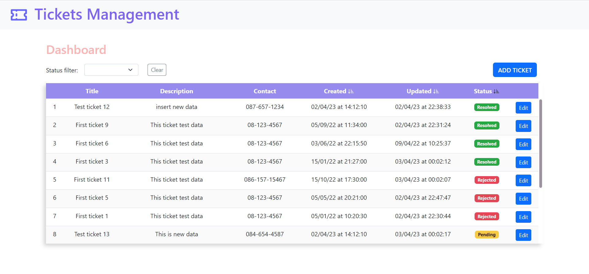
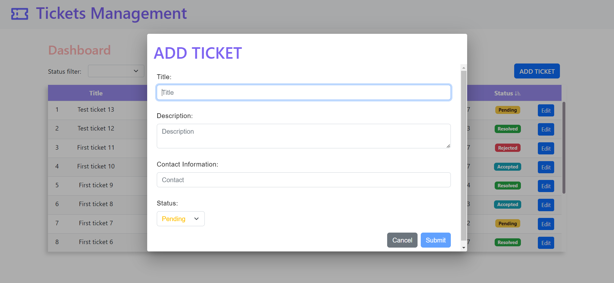

# Ticket Management

MEAN is a set of Open Source components that together, provide an end-to-end framework for building dynamic web applications; starting from the top (code running in the browser) to the bottom (database). The stack is made up of:

- **M**ongoDB : Document database – used by your back-end application to store its data as JSON (JavaScript Object Notation) documents
- **E**xpress (sometimes referred to as Express.js): Back-end web application framework running on top of Node.js
- **A**ngular (formerly Angular.js): Front-end web app framework; runs your JavaScript code in the user's browser, allowing your application UI to be dynamic
- **N**ode.js : JavaScript runtime environment – lets you implement your application back-end in JavaScript

## Pre-requisites

- git - [Installation guide](https://www.linode.com/docs/development/version-control/how-to-install-git-on-linux-mac-and-windows/) .
- node.js - [Download page](https://nodejs.org/en/download/) .
- npm - comes with node or download yarn - [Download page](https://yarnpkg.com/lang/en/docs/install) .
- mongodb - [Download page](https://www.mongodb.com/download-center/community) .

## Getting Started

```
Clone or Download the zip file of this repository.
cd ticket-helpdesk
npm install
npm run dev
```

### OR

In fisrt Terminal in code editer

```
npm run server
```

In Second Terminal in code editer

```
npm start
```

connect your mongoDB to local server to mongodb://localhost:27017.

Then Go to http://localhost:4200/ to see application

## To import Test Data to server

```
npm run import_data
```

# Ticket Dashboard

### Dashboard

'

### Sorted Data

'

### Filterd Data

'

### Create Ticket

'

### Edit Ticket Information

'
